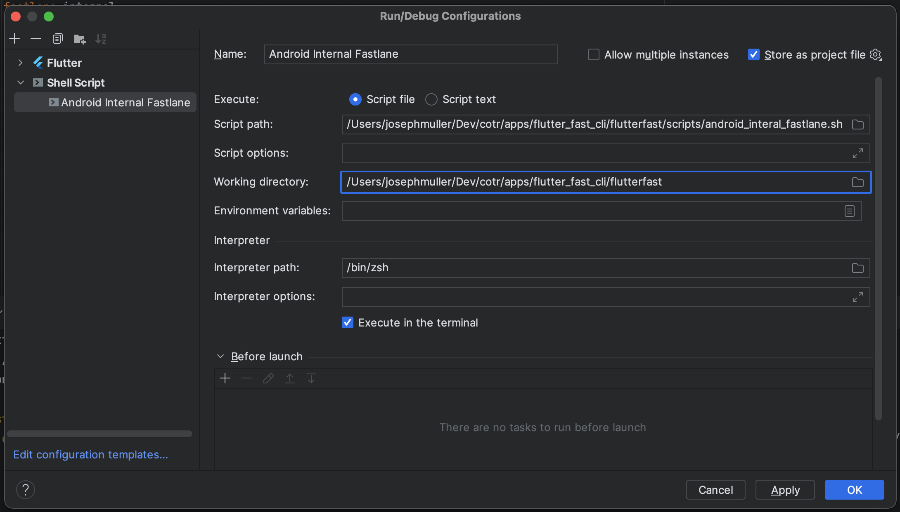
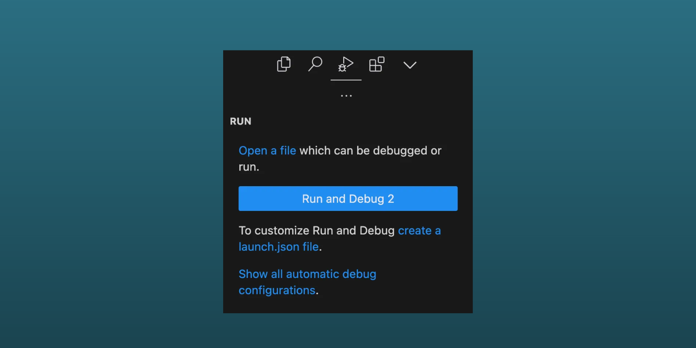

## Before Generating Your App
Nothing to do ☕️

## After Generating Your App

### Get your Credentials
Follow the instructions on the [Fastlane Supply page](https://docs.fastlane.tools/actions/supply/#setup%20to%20get%20one) to create the necessary credentials for uploading to the Google Play store and the App Store.

### Create Run Configurations
The Flutter Fast boilerplate includes simple shell scripts you can use to run the Fastlane files without using the terminal.

#### Android Studio
:::note
This is completed for you in version 1.0.3.
:::
1. Select the drop down by the run button in the top toolbar
2. Select "Edit Configurations"
3. Add a new "Shell Script" configuration using the plus icon
4. Rename the configuration to match the Fastlane file you are setting up (ex. Android Internal Fastlane)
5. Update the script path to point to the matching fastlane script (in the scripts folder)
6. Update the working directory to point to your app's root folder
7. Hit "OK"




Once this is setup, you can run the "Android Internal Fastlane" script from the runner dropdown.

#### VS Code

:::note
This is completed for you in version 1.0.3
:::

On the Run and Debug tab, select the link to create a launch.json file if you don't already have one. Choose the "Dart and Flutter" template when asked: 




Add a new entry to the configurations list that looks like this:
```
{
    "name": "iOS Beta Fastlane",
    "request": "launch",
    "type": "node-terminal",
    "command": "bash ${workspaceFolder}/scripts/ios_beta_fastlane.sh",
}
```
Now you can select "iOS Beta Fastlane" from the runner dropdown. Repeat steps to setup other fastlanes.
