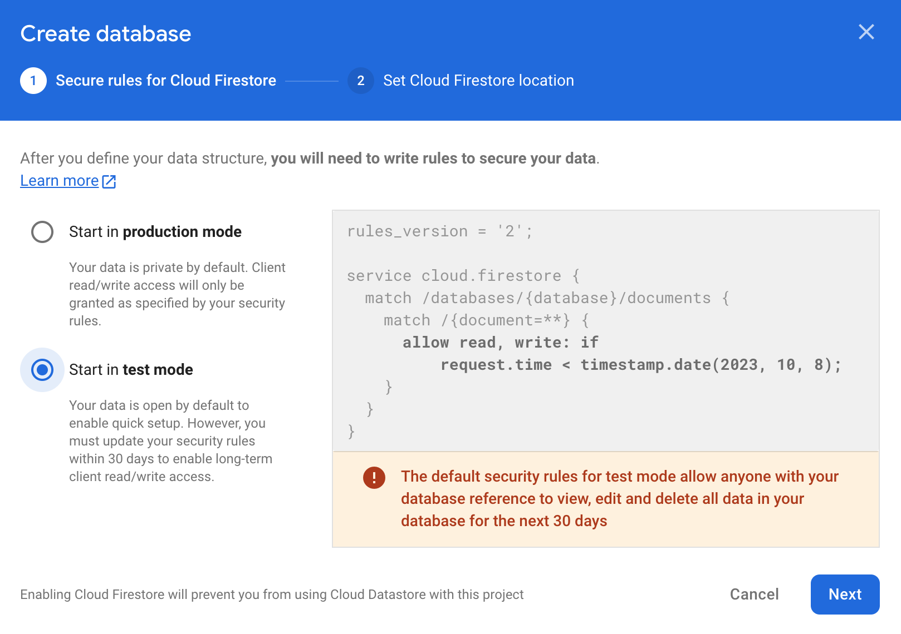
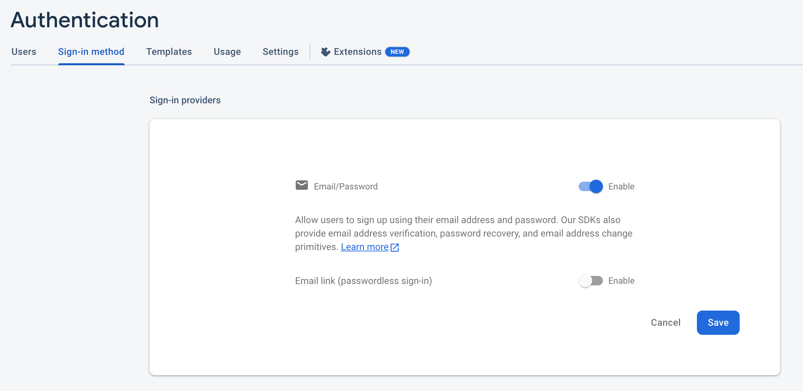
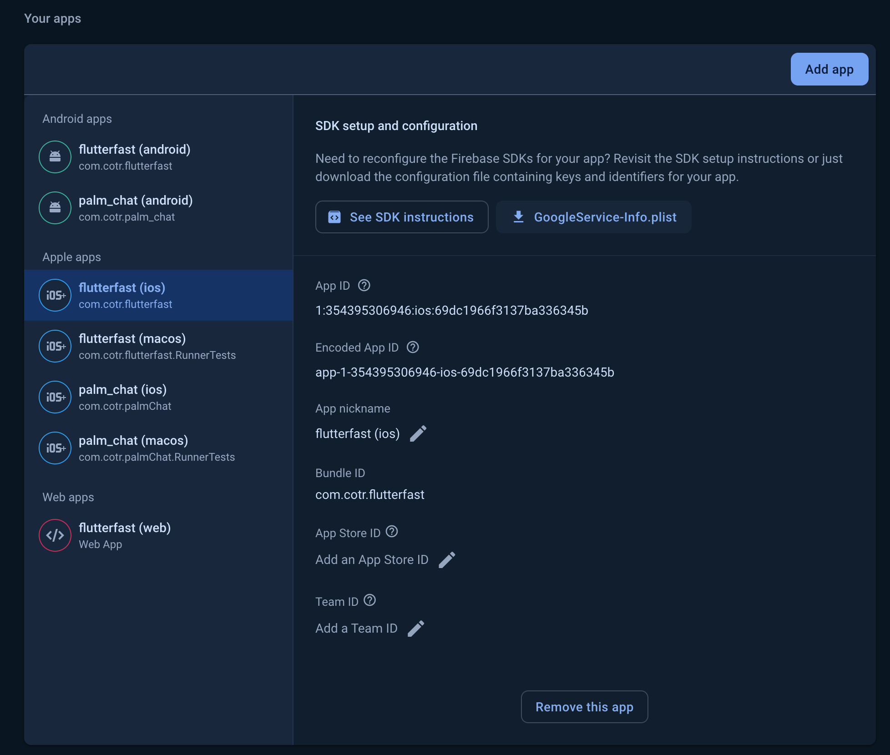

This page explains how to set up your Flutter Fast Firebase project.

## Setup
### Before Generating Your App
Create a new [Firebase project](https://firebase.google.com/docs/projects/learn-more).

- test

In the Firebase Console:

1. Create a new Firestore database. Be sure to update the rules so you can make requests



1. Set up [Firebase Authentication](https://firebase.google.com/docs/auth/flutter/start) and enable email authentication (Authentication -> Sign-in method -> Native providers -> Email/Password)




### After Generating Your App
Run the flutterfire config command and select the project you just created. A `firebase_options.dart` file should be added to the lib directory. 

The Flutter Fast CLI will complete the [Flutter setup steps](https://firebase.google.com/docs/flutter/setup?platform=ios) so you won't need to touch any code. You're good to go 👍

## Authentication

### Google Sign In
Enable Google Sign In in your Firebase console and follow the [official instructions](https://firebase.google.com/docs/auth/flutter/federated-auth) to complete the setup. 

Run `flutterfire config` inside your Flutter app to setup each platform. Its important to run this after enabling Google Sign in so that the generated GoogleServices-Info files contain the correct information.

#### Android

Next, [add your machine's SHA1](https://developers.google.com/android/guides/client-auth) to your Firebase settings. To do this, you'll first need to create your release key:
```shell
keytool -genkey -v -keystore ~/Dev/keys/flutterfast.jks -keyalg RSA -keysize 2048 -validity 10000 -alias upload
```
Then you can list the details of that key to find the SHA1:
```shell
keytool -list -v -alias upload  -keystore ~/Dev/keys/flutterfast.jks 
```
The SHA1 and SHA256 will be listed under "Certificate fingerprints". Add these to your Firebase project under Project Settings -> Your Apps -> Android App -> SHA certificate fingerprints.

You will also need to add your debug SHA1 which you can find using this command (password is "android"):
```shell
keytool -list -v -alias androiddebugkey -keystore ~/.android/debug.keystore
```

 and then add the [google_sign_in](https://pub.dev/packages/google_sign_in) package and follow the instructions for setting up each platform.


#### iOS
You can find your CLIENT_ID in `ios/Runner/GoogleService-Info.plist`. If you don't see it there, you can also navigate to the project settings screen in the Firebase console, select the iOS app from the app list, and download the most up to date file.


Once you've found the client ID, add it to `Info.plist`:
```plist
<key>GIDClientID</key>
<!-- TODO Replace this value: -->
<!-- Copied from GoogleService-Info.plist key CLIENT_ID -->
<string>[YOUR IOS CLIENT ID]</string>
```

You'll also need to add the following section with your `REVERSED_CLIENT_ID`:
```plist
<!-- Put me in the [my_project]/ios/Runner/Info.plist file -->
<!-- Google Sign-in Section -->
<key>CFBundleURLTypes</key>
<array>
	<dict>
		<key>CFBundleTypeRole</key>
		<string>Editor</string>
		<key>CFBundleURLSchemes</key>
		<array>
			<!-- TODO Replace this value: -->
			<!-- Copied from GoogleService-Info.plist key REVERSED_CLIENT_ID -->
			<string>com.googleusercontent.apps.861823949799-vc35cprkp249096uujjn0vvnmcvjppkn</string>
		</array>
	</dict>
</array>
<!-- End of the Google Sign-in Section -->
```