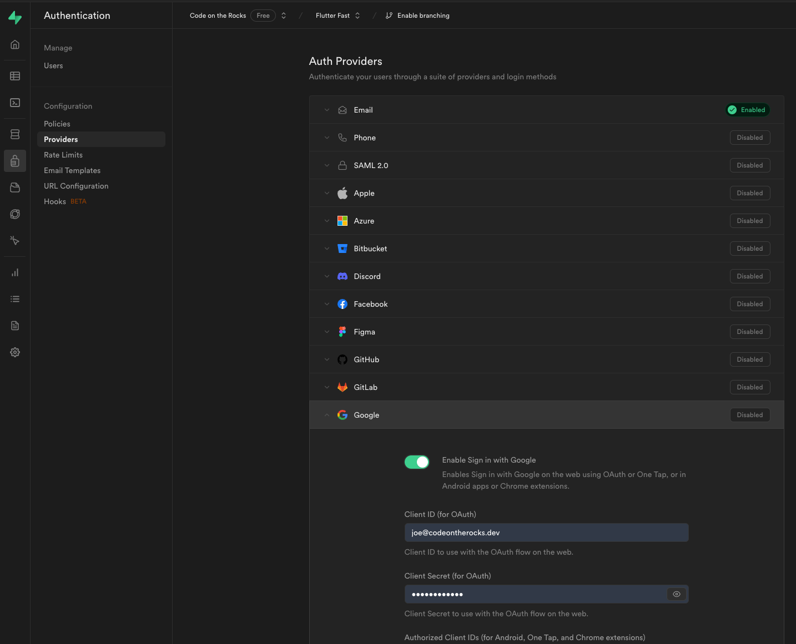
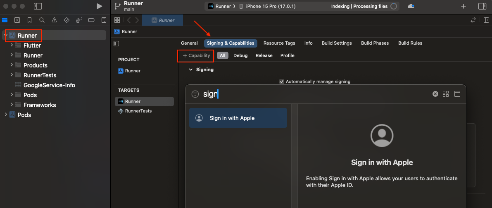

## Setup
### Before Generating Your App
Create a Supabase account and project: https://supabase.com/

### After Generating Your App
After creating your Supabase project, add the following variables to your `config.json` file:

```
"SUPABASE_URL": "",
"SUPABASE_ANON_KEY": ""
```
The SUPABASE_URL value can be found in the dashboard here:

> All Projects -> {Your Project} -> Project Settings -> API -> Project URL

The SUPABASE_ANON_KEY value can be found on the same page:

> All Projects -> {Your Project} -> Project Settings -> API -> Project API keys (anon public)

The [Flutter setup steps](https://supabase.com/docs/guides/getting-started/quickstarts/flutter) will be completed by the Flutter Fast CLI.

## Authentication

### Google Sign In

Navigate to the Authentication tab in your Supabase console, select the "Providers" section, and enable Google Sign In.



The [Login with Google documentation](https://supabase.com/docs/guides/auth/social-login/auth-google) is easy to follow. The [Flutter specific guide](https://supabase.com/docs/reference/dart/auth-signinwithoauth) is also handy.

Next add the [google_sign_in](https://pub.dev/packages/google_sign_in) package to your `pubspec.yaml`.
 
#### Android

[Create a SHA1 fingerprint](https://developers.google.com/android/guides/client-auth). To do this, you'll first need to create your release key:
```shell
keytool -genkey -v -keystore ~/Dev/keys/flutterfast.jks -keyalg RSA -keysize 2048 -validity 10000 -alias upload
```
Then you can list the details of that key to find the SHA1:
```shell
keytool -list -v -alias upload  -keystore ~/Dev/keys/flutterfast.jks 
```
The SHA1 and SHA256 will be listed under "Certificate fingerprints". Jot these down for later.

You will also need to your debug SHA1 which you can find using this command (password is "android"):
```shell
keytool -list -v -alias androiddebugkey -keystore ~/.android/debug.keystore
```

[Create a new credential in your Google Cloud console](https://console.cloud.google.com/apis/credentials).

1. Click "Create credentials" 
2. Select "OAuth client ID"
3. Select your application type (Android)
4. Enter your credential name, package name, and SHA1 from above
5. Click "Create"

Once the credential is created, locate it on the credentials tab and copy the client ID. Add this to the `config.json` file under the `GOOGLE_ANDROID_CLIENT_ID` key.

#### iOS

[Create a new credential in your Google Cloud console](https://console.cloud.google.com/apis/credentials).

1. Click "Create credentials" 
2. Select "OAuth client ID"
3. Select your application type (iOS)
4. Enter your credential name, package name, and SHA1 from above
5. Click "Create"

Once the credential is created, locate it on the credentials tab and copy the client ID. Add this to the `config.json` file under the `GOOGLE_IOS_CLIENT_ID` key.


### Web
[Create a new credential in your Google Cloud console](https://console.cloud.google.com/apis/credentials).

1. Click "Create credentials" 
2. Select "OAuth client ID"
3. Select your application type (iOS)
4. Enter your credential name, package name, and SHA1 from above
5. Click "Create"

Once the credential is created, locate it on the credentials tab and copy the client ID. Add this to the `config.json` file under the `GOOGLE_WEB_CLIENT_ID` key.

You will also need to add this value in your Supabase console under "Authorized Client IDs" in the Google Sign In section.

### Apple Sign In
Add the [sign_in_with_apple](https://pub.dev/packages/sign_in_with_apple) package to your `pubspec.yaml`.

#### Android

#### iOS
Open your project in Xcode and add the "Sign in with Apple" capability.
