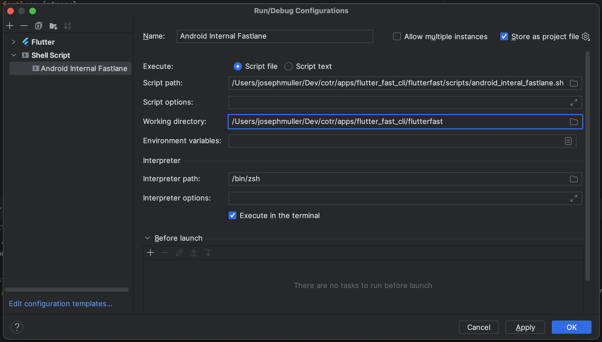

## Before Generating Your App
Nothing to do ☕️

## After Generating Your App
### Create Run Configurations
The Flutter Fast boilerplate includes simple shell scripts you can use to run the Fastlane files without using the terminal.

#### Android Studio
1. Select the drop down by the run button in the top toolbar
2. Select "Edit Configurations"
3. Add a new "Shell Script" configuration using the plus icon
4. Rename the configuration to match the Fastlane file you are setting up (ex. Android Internal Fastlane)
5. Update the script path to point to the matching fastlane script (in the scripts folder
6. Update the working directory to point to your app's android folder
7. Hit "OK"

