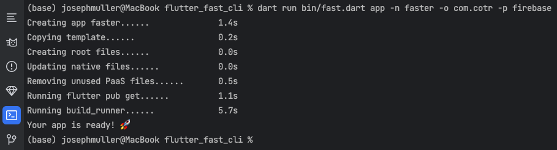

Flutter is fast by default, but setting up a new project isn't. You need...

- An authentication service with sign in, sign up, forgot password, and profile pages. 
- Onboarding logic.
- A database. 
- A dependency injection solution. 
- A state management package. 
- A theme. 
- A handful of dependencies in your pubspec. 
- An analysis_options.yaml file. 
- Extensions.
- CI/CD files.
- A trusty .gitignore.
- A subscription service and offering page.
- Crash reporting.
- An analytics infrastructure.
- A router and navigation guards.
- That thing you always forget.
- That other thing you always forget.

I created Flutter Fast because I wanted to jump straigt into the fun part of building my ideas without spending the first 8 hours getting everything _just_ right.

The Flutter Fast CLI solves this problem. In less than 60 seconds (30 seconds, usually), you can have a fully featured Flutter application using the platforms and tools that you want to use.

🔥 Firebase? Yup!

⚡️ Supabase? Sure!

✍️ AppWrite? Soon!

### Save Time
Don't waste time and that excited energy building the same features you've built a thousand times. With Flutter Fast, you'll save 10+ hours in what would have been tedious setup development.

### Start Strong
The Flutter Fast boilerplate adheres to coding best practices, providing you and your team with a solid foundation to build off of. It is also updated weekly so every new app you create will be on the cutting edge.

### Ship Often
The boilerplate comes with several CI/CD goodies so you can start shipping about as fast as you can run the script. We've included Fastfiles from [Fastlane](https://fastlane.tools/) and bash scripts to make building for Android and iOS as easy as clicking a button.

### Stay Flexible
One of the biggest advantages of Flutter Fast over other app-generating CLI's is that it allows you to choose between different Platform-as-a-Service offerings. Try Firebase. Try Supabase. Try AppWrite. The beauty in the boilerplate is that all of the vital services are abstractions that can be implemented an unlimited number of ways. As the Flutter Fast platform grows, we'll add more options to the tech stack.