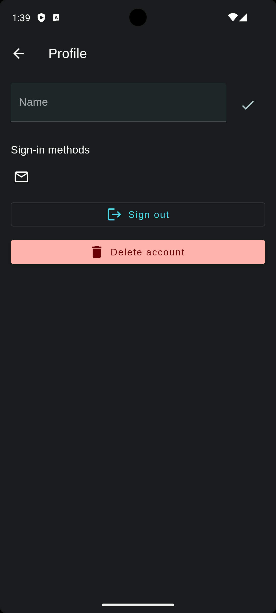
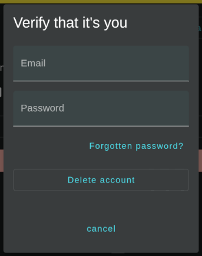

To delete your account, perform the following steps:
#### 1. Open the side drawer inside the application
#### 2. Select the "Profile" option
#### 3. On the profile page, press the "Delete account" button

#### 4. Enter your email and password

#### 5. Press "Delete account"

