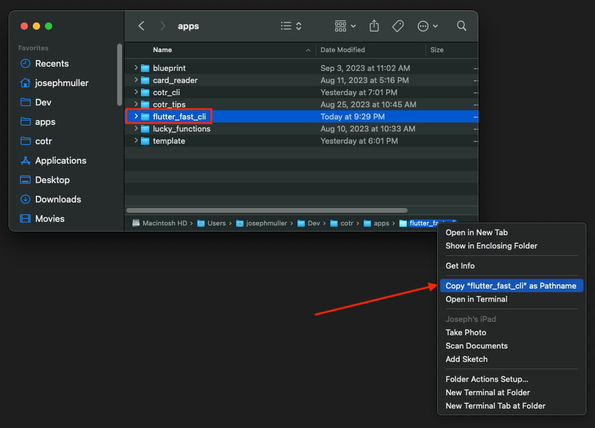

import { LinkCard, CardGrid } from '@astrojs/starlight/components'

## Get It


You can purchase the Flutter Fast CLI on [Gumroad](https://codeontherocks.gumroad.com/l/flutterfast). Your purchase gets you the Flutter Fast source code, lifetime access to the CLI, and unlimited updates. Whenever new platforms are added or the boilerplate Flutter code is updated, you'll be able to download the newest version and start building.

<LinkCard title="Download the CLI" 
description="Buy once, build forever"
	href="https://codeontherocks.gumroad.com/l/flutterfast">
</LinkCard>

## Activate It
Once you've purchased and downloaded the CLI, move it to a safe location on your computer. Run the following command to [activate the CLI on your local machine](https://dart.dev/tools/pub/cmd/pub-global#activating-a-package-on-your-local-machine):
```
dart pub global activate --source path <path>
```
The path variable should point to the root of the Flutter Fast Dart project. The easiest way to find the path is to select it in your Finder and right-click on the folder alon the bottom of the Finder window. In the pop up menu, there should be a "Copy "flutter_fast_cli" as Pathname" option:


If done correctly, you should see the following output in your terminal:
```
Installed executable fast.
Activated flutter_fast_cli 1.0.0 at path "/Users/josephmuller/Dev/cotr/apps/flutter_fast_cli".
(base) josephmuller@MacBook flutter-fast-guide %
```

You can further verify that the CLI has been activated by [listing your active Dart packages](https://dart.dev/tools/pub/cmd/pub-global#listing-active-packages):
```
dart pub global list
```

You should see an entry for `flutter_fast_cli` with the path name specified above.

## Uninstall It
If you want to [uninstall the CLI](https://dart.dev/tools/pub/cmd/pub-global#deactivating-a-package), run the following command:
```
dart pub global deactivate flutter_fast_cli
```